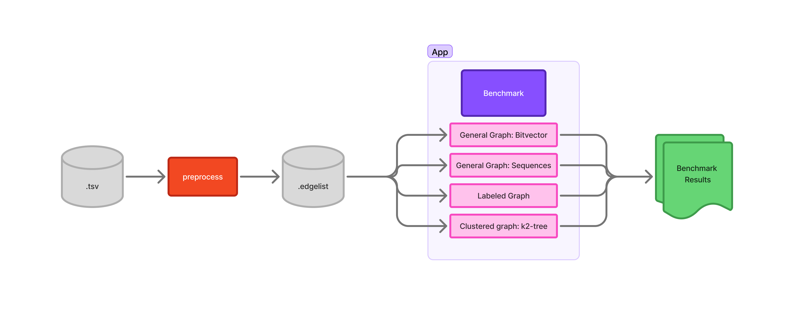

# EstructurasDeDatosCompactasCC7320
Compact analysis for a Reddit hyperlinks graph.

## Architecture

## Compile

g++ -std=c++17 appBenchmark/benchmark.cpp appBenchmark/graph.cpp appBenchmark/graphBitVector.cpp appBenchmark/graphSequence.cpp appBenchmark/canonicalDS/bitVector.cpp appBenchmark/canonicalDS/Sequence.cpp appBenchmark/canonicalDS/permutation.cpp -IappBenchmark -IappBenchmark/canonicalDS -o appBenchmark/bin/benchmark_bin

## Run

./appBenchmark/bin/benchmark_bin graphs/reddit_numeric.edgelist